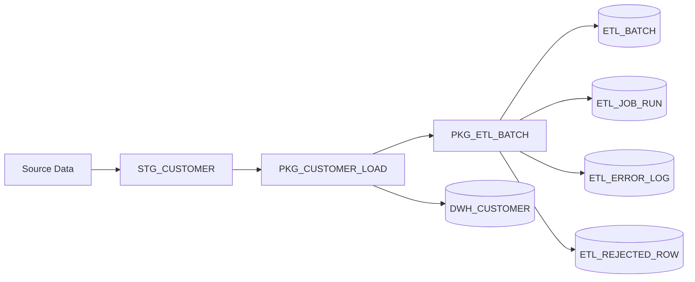

# Oracle ETL Batch Framework

<p align="center">
  
  
  
  
</p>

> **Reusable PL/SQL framework for observable and restartable ETL processing.**

## Architecture



A reusable, lightweight ETL batch execution framework implemented in Oracle SQL and PL/SQL.

The project demonstrates:

- batch and job execution tracking;
- restartable processing;
- row counters;
- structured error logging;
- rejected-row capture;
- execution status management;
- autonomous transaction logging;
- reusable PL/SQL APIs;
- end-to-end staging-to-target processing.

## Why this project exists

ETL processes often start as independent scripts. Over time, they become difficult to operate because there is no consistent way to answer basic questions: which batch is running, which job failed, how many rows were processed, what caused the failure, and whether the job can be safely restarted.

This project centralizes that operational metadata.

## Repository structure

```text
oracle-etl-batch-framework/
├── README.md
├── install.sql
├── uninstall.sql
├── sql/
├── plsql/
├── tests/
└── docs/
```

## Status model

```text
RUNNING
SUCCESS
FAILED
PARTIAL
```

A batch becomes `PARTIAL` when processing completes but one or more rows are rejected.

## Installation

```sql
@install.sql
```

The project is suitable for Oracle Database 19c+ and is also appropriate for Oracle Database 23ai / 26ai.

## Quick start

```sql
@tests/01_run_success.sql
@tests/02_run_with_rejects.sql
@tests/03_operational_queries.sql
```

Or execute:

```sql
begin
    pkg_customer_load.run;
end;
/
```

## Operational queries

```sql
select *
from etl_batch
order by batch_id desc;

select *
from etl_rejected_row
order by reject_id desc;

select *
from etl_error_log
order by error_id desc;
```

## Restartability

The framework tracks executions and failures. A production solution can extend this with watermark-based restart, restart from the last successful step, partial reprocessing, or staging partition reloads.

The demo uses idempotent upsert logic so the customer load can be rerun safely.

## Design & Engineering Decisions

### Separate orchestration from business logic
The framework keeps operational concerns in `PKG_ETL_BATCH` and business-specific loading logic in `PKG_CUSTOMER_LOAD`. This makes the orchestration layer reusable.

### Persist technical diagnostics independently
Technical error logging uses `PRAGMA AUTONOMOUS_TRANSACTION` so diagnostic information can survive even if the main ETL transaction rolls back.

### Treat rejected business rows differently from technical failures
Technical errors are stored in `ETL_ERROR_LOG`; validation failures are stored in `ETL_REJECTED_ROW`.

### Make reruns safe
The customer demo uses upsert behavior to illustrate idempotent processing.

### Keep execution history
Each job execution is stored separately in `ETL_JOB_RUN`, preserving historical failures, runtime patterns and row counts.

### Track processing metrics
The framework records rows read, inserted, updated and rejected.

### Keep the framework intentionally lightweight
The project focuses on core Oracle/PLSQL orchestration patterns rather than trying to reproduce a complete external scheduler.

## Key Takeaways

- Reliable ETL requires operational metadata, not only transformation SQL.
- Restartability is easier when processing is designed to be idempotent.
- Technical exceptions and data-quality rejects should be handled separately.
- Autonomous logging can preserve diagnostics across rollbacks.
- A small generic orchestration API can standardize many PL/SQL loads.

## Skills demonstrated

Oracle SQL · PL/SQL · ETL · Data Warehousing · MERGE · Exception Handling · Autonomous Transactions · Auditability

## Possible extensions

- dependency management;
- DBMS_SCHEDULER integration;
- watermark-based incremental loads;
- retries and SLA tracking;
- ORDS monitoring API;
- APEX operational dashboard.

## LinkedIn

A LinkedIn-ready project description is available in [docs/linkedin-project.md](docs/linkedin-project.md).

## License

MIT License. See [LICENSE](LICENSE).
